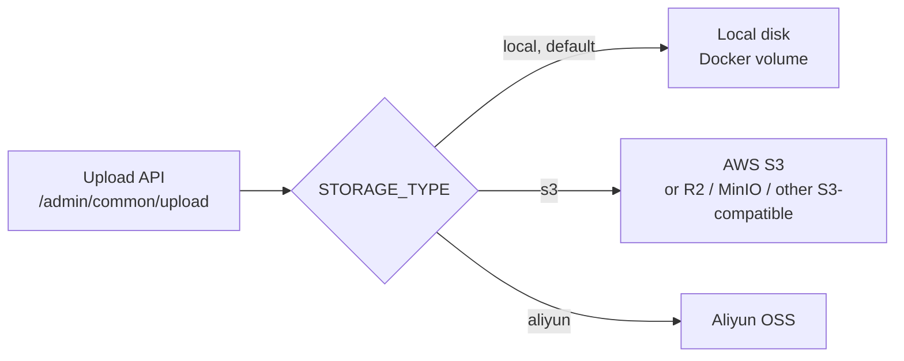

# Restaurant System

**English** | [繁體中文](README.zh-TW.md)

[](https://github.com/totoffy158180/restaurant-system/actions/workflows/ci.yml)

An admin dashboard for a food delivery restaurant: manage employees, categories, dishes, set meals, and orders. The UI switches between Traditional Chinese and English, and uploaded images can be stored on local disk, AWS S3, or Aliyun OSS.

## Tech Stack

| Layer | Technologies |
|---|---|
| Frontend | Vue 2, TypeScript, Element UI, vue-i18n |
| Backend | Spring Boot 2.7, MyBatis, JWT, Java 17 |
| Data | MySQL 8, Redis 7 |
| Storage | Local disk / AWS S3 (S3-compatible) / Aliyun OSS, switchable |
| Translations | Tolgee |
| CI | GitHub Actions, JUnit 5, Testcontainers, Jest |
| Deployment | Docker Compose, nginx |

## Quick Start (Docker)

All you need is [Docker Desktop](https://www.docker.com/products/docker-desktop/). No Java, Node, database, or cloud account required.

```bash
git clone https://github.com/totoffy158180/restaurant-system.git
cd restaurant-system
docker compose up -d --build
```

The first start takes about 5–10 minutes (pulling images and compiling). Once `docker compose ps` shows all 4 services `Up` and mysql `healthy`, open:

- Admin dashboard: http://localhost
- Default account: `admin` / `123456`

On first start, the database runs [`db/init.sql`](db/init.sql) to create the tables and seed data (an admin account, 10 categories, and 24 dishes).

```bash
docker compose down      # stop, keep data
docker compose down -v   # stop and delete the database and uploaded images; the next start re-initializes
```

### Services and Ports

| Service | URL | Notes |
|---|---|---|
| frontend | http://localhost | nginx, proxies `/api/` and `/uploads/` to the backend |
| backend | http://localhost:8082 | Bound to localhost only; API docs: http://localhost:8082/doc.html |
| mysql | `localhost:3307` | Bound to localhost only, user `root` / password `root` |
| redis | — | Not exposed |

### Configuration (Optional)

Everything works without configuration. To change settings, copy the example file and edit it:

```bash
cp .env.example .env
```

| Variable | Default | Description |
|---|---|---|
| `MYSQL_ROOT_PASSWORD` | `root` | Only applied when the database is first initialized |
| `JWT_ADMIN_SECRET` | `itcast` | JWT signing secret; change it in production |
| `FRONTEND_PORT` / `BACKEND_PORT` / `MYSQL_PORT` | `80` / `8082` / `3307` | Host ports |
| `STORAGE_TYPE` | `local` | Image storage: `local` / `s3` / `aliyun` (see below) |
| `S3_*` | — | Used when `STORAGE_TYPE=s3` |
| `OSS_*` | — | Used when `STORAGE_TYPE=aliyun` |

`.env` is ignored by git. Never put keys in a file that gets committed.

## Image Storage

Uploads go through a `FileStorage` interface, and `STORAGE_TYPE` selects the implementation without any code changes:



| Mode | Best for | Account needed |
|---|---|---|
| `local` | Local development, running right after cloning | None |
| `s3` | Production | AWS or another S3-compatible service |
| `aliyun` | Environments already using Aliyun OSS | Aliyun |

Design rationale: local disk is the default so anyone who clones the repo can use every feature. In production, an environment variable switches to S3, and the keys only exist in the deployment environment. The S3 implementation uses AWS SDK v2 with a configurable endpoint, so the same code also works with Cloudflare R2, MinIO, or Aliyun OSS in S3-compatible mode.

Example AWS S3 configuration:

```bash
STORAGE_TYPE=s3
S3_REGION=ap-northeast-1        # must match the region the bucket is in
S3_BUCKET=your-bucket
S3_ACCESS_KEY_ID=...
S3_ACCESS_KEY_SECRET=...
```

The bucket must allow public reads (`s3:GetObject`). The IAM key used by the app only needs `s3:PutObject` on that bucket.

Upload limits: jpg / jpeg / png / gif / webp only, up to 2MB per file.

## Local Development

Requirements: JDK 17, Maven, MySQL 8, Redis, and Node 16 (managing it with [nvm](https://github.com/nvm-sh/nvm) is recommended).

### Database

```bash
mysql -uroot -e "CREATE DATABASE sky_take_out DEFAULT CHARACTER SET utf8mb4"
mysql -uroot sky_take_out < db/init.sql
```

You can also run only MySQL in Docker with `docker compose up -d mysql` and point the backend at `localhost:3307` (`DB_PORT=3307`, `DB_PASSWORD=root`). Redis in Docker is not exposed, so you still need a local Redis for development.

### Backend

Open `backend/` in IntelliJ IDEA, **set the Project SDK to JDK 17** (newer JDKs make Lombok fail to compile), and run `SkyApplication`. Or from the command line:

```bash
cd backend
./start-backend.sh
```

By default the backend connects to `localhost:3306` (root / empty password) and `localhost:6379`. Override with environment variables:

| Variable | Default |
|---|---|
| `DB_HOST` / `DB_PORT` / `DB_NAME` | `localhost` / `3306` / `sky_take_out` |
| `DB_USERNAME` / `DB_PASSWORD` | `root` / empty |
| `REDIS_HOST` / `REDIS_PORT` / `REDIS_DATABASE` | `localhost` / `6379` / `10` |

Personal settings such as cloud keys can go in `backend/sky-server/src/main/resources/application-local.yml`, which is ignored by both git and Docker. For example:

```yaml
sky:
  storage:
    type: s3
    s3:
      region: ap-northeast-1
      bucket: your-bucket
      access-key-id: ...
      access-key-secret: ...
```

In local mode, uploaded images are saved to `backend/uploads/` (ignored by git).

### Frontend

```bash
cd frontend
nvm use 16
npm install
npm run serve
```

Open http://localhost:8888. The dev server proxies `/api` and `/uploads` to `http://localhost:8080`.

- Some dependencies are old, so `frontend/.npmrc` sets `legacy-peer-deps=true`. Just use `npm install`.
- Restart `npm run serve` after changing `vue.config.js` or `.env.*`.

## Internationalization

- The frontend uses vue-i18n. Translation files live in [`frontend/src/lang/`](frontend/src/lang/), and keys follow `page.section.item`, e.g. `dish.form.name`.
- The backend returns error keys (e.g. `PASSWORD_ERROR`), which the frontend translates in one place.
- The language switch (EN | 繁中) is in the top-right corner, and the choice is saved in a cookie.
- Database content such as dish and category names is not translated. Flavor options and order rejection reasons are stored in their original text and only translated for display.

### Translation Management (Tolgee)

[Tolgee](https://tolgee.io) is the source of truth for translations. The JSON files in the repo are a snapshot, so the project builds without Tolgee access.

```bash
cd frontend
npx -y -p node@22 -p @tolgee/cli@2 tolgee login <API key>   # first time only
npm run i18n:pull    # download the latest translations from Tolgee
npm run i18n:push    # upload local translations to Tolgee
npm run i18n:check   # check that every key used in code has a translation
```

The Tolgee CLI requires Node 18+, so these commands temporarily run it on Node 22 without affecting the project's Node 16. GitHub Actions syncs translations from Tolgee daily and opens a PR when something changes.

## Tests and CI

```bash
(cd backend && mvn -pl sky-server -am verify)   # backend tests (the S3 test needs Docker)
(cd frontend && npm run test:unit)              # frontend unit tests
```

The backend S3 upload test uses Testcontainers to start an S3 mock, so no AWS account is needed.

On every PR and push to `main`, [GitHub Actions](.github/workflows/ci.yml) runs:

- Backend build and tests
- Frontend translation key check, unit tests, and build
- Docker image builds for the frontend and backend

## Project Structure

```
.
├── backend/                 Spring Boot (Maven multi-module)
│   ├── sky-common/          Shared utilities, constants, storage implementations
│   ├── sky-pojo/            DTOs, entities, VOs
│   └── sky-server/          Controllers, services, mappers, configuration
├── frontend/                Vue 2 admin dashboard
│   ├── src/lang/            Translation files
│   ├── nginx.conf           nginx config for Docker
│   └── .tolgeerc.json       Tolgee CLI config
├── db/init.sql              Database initialization script
├── docker-compose.yml
├── .env.example
└── .github/workflows/       CI and translation sync
```

## Known Limitations

- The Dashboard and Statistics pages are not translated yet.
- Backend APIs for orders, the dashboard, and statistics are not implemented yet, so those pages have no data.
- The WebSocket for new-order alerts is not implemented.
- Seed dish images are served from an external OSS bucket.
